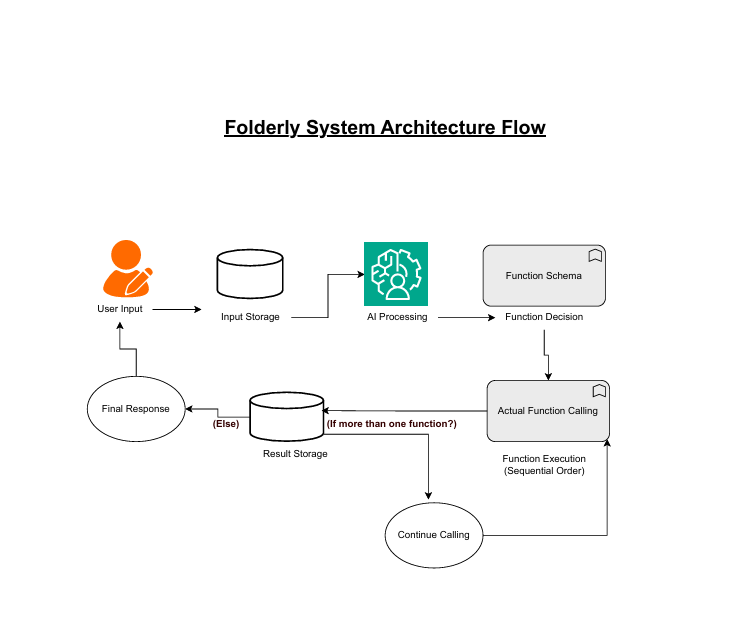

# Folderly - Smart Desktop File Management with AI Integration 🚀

Folderly is an intelligent desktop file management system that combines powerful file operations with AI-powered assistance. It helps you organize, declutter, and manage your files across Desktop, Documents, Downloads, and other folders with natural language commands and smart automation.

## 📦 **Current Version: v1.0.5**

**Latest Release:** Available on PyPI as `folderly` package
**Status:** Production Ready - Stable Release with Enhanced Path Display & Fixed Package Structure

### **Quick Start (30 seconds)**
```bash
# Install from PyPI
pip install folderly

# Set API key
echo "OPENAI_API_KEY=your_key_here" > .env

# Start using!
folderly-ai
```

### **For Non-Tech Users:**
```bash
# Install Python (if not already installed)
winget install Python.Python.3.12

# Install Folderly
pip install folderly

# Launch Folderly
folderly-ai
```

## ✨ **Current Features (v1.0.5)**

### **🤖 AI-Powered Interface**
- **Natural language commands** - "list my desktop", "create a folder called work", "move all txt files to documents"
- **Smart function selection** - AI automatically chooses the right operation for your request
- **Beautiful formatted output** - Clean, emoji-enhanced results with full paths for operations
- **Multi-task handling** - Execute multiple operations from a single command
- **Real-time streaming responses** - See AI responses build up word by word for instant feedback
- **Progress indicators** - Visual feedback for all operations with completion status

### **📁 Core File Operations**
- **List and explore** files/folders with advanced filtering (extension, type, date, size)
- **Create directories** - Single or multiple nested folders
- **Move files/folders** - Bulk operations with smart execution
- **Copy items** - Safe copying with conflict handling
- **Rename items** - Batch renaming operations
- **Delete safely** - Files go to recycle bin (not permanent deletion)
- **Search and filter** - By pattern, extension, file type, or modification date

### **⚡ Performance & Smart Execution**
- **Async operations** - Non-blocking file operations for better performance
- **Smart execution strategy** - Automatic parallel/sequential mode selection
- **Parallel processing** - Multiple independent operations run simultaneously
- **Sequential safety** - Dependent operations execute in order

### **🎯 Easy Configuration**
- **Flexible targeting** - Manage Desktop, Documents, Downloads, Pictures, Music, Videos
- **OneDrive support** - Automatic detection of OneDrive folder structures
- **Smart path discovery** - Automatically finds all Desktop/Documents locations including OneDrive variations
- **Cross-platform** - Works on Windows, macOS, and Linux
- **Simple setup** - Just set your OpenAI API key and start using

## 🚀 **Quick Start**

### **Prerequisites**
- Python 3.8+
- OpenAI API key

### **Installation**

#### **Option 1: PyPI (Recommended for Users)**
```bash
# Install from PyPI
pip install folderly

# Set up your OpenAI API key
echo "OPENAI_API_KEY=your_api_key_here" > .env

# Start using Folderly!
folderly-ai
```

#### **Option 2: Poetry (Recommended for Developers)**
```bash
# Clone the repository
git clone <repository-url>
cd Folderly-ProtoType

# Install dependencies
poetry install

# Set up your OpenAI API key
echo "OPENAI_API_KEY=your_api_key_here" > .env

# Start using Folderly!
poetry run folderly-ai
```

#### **Option 3: Traditional Python**
```bash
# Clone the repository
git clone <repository-url>
cd Folderly-ProtoType

# Install dependencies
pip install -r requirements.txt

# Set up your OpenAI API key
echo "OPENAI_API_KEY=your_api_key_here" > .env

# Start using Folderly!
python -m src.ai.ai_integration
```

#### **Option 4: Docker (Recommended for Production)**
```bash
# Clone the repository
git clone <repository-url>
cd Folderly-ProtoType

# Build and run with Docker Compose
docker-compose up --build

# Or build manually
docker build -t folderly .
docker run -it folderly

# Set up your OpenAI API key in .env file
echo "OPENAI_API_KEY=your_api_key_here" > .env
```

> 📖 **For detailed Docker instructions, see [Docker Usage Guide](docs/DOCKER_USAGE.md)**

## 💬 **Usage Examples**

### **Listing and Exploring**
```
💭 You: list my desktop
🤔 AI is thinking...
🤖 I'll help you scan your Desktop. Let me discover all available Desktop locations first...
🔧 Function call detected, executing...
🔧 Executing: discover_user_paths
🔍 Discovering user paths... ✅

I found 3 Desktop locations:
1. 📂 C:\Users\username\Desktop - 15 files 💾 Local
2. 📂 C:\Users\username\OneDrive\Desktop - 8 files ☁️ OneDrive

Which one should I scan?

💭 You: 1
🔧 Executing: list_directory_items
🔍 Scanning directory... ✅

📋 Items in Desktop:
1. 📁 .git.lnk
2. 📁 ai_test_destination  
    3. Animals
    4. async practice
    5. Backup

💭 You: show me all PDF files in documents
🤖 📋 PDF Files in Documents:
    1. report.pdf
    2. presentation.pdf
    3. manual.pdf
```

### **Creating and Organizing**
```
💭 You: create a folder called "work" and move all txt files there
🤖 🎯 Operation Results:
    ✅ Created: 'work' folder
       📍 Location: Desktop
       🗂️ Full Path: C:/Users/username/Desktop/work

    ✅ Moved: 'notes.txt', 'todo.txt', 'ideas.txt'
       📍 Destination: work folder
       🗂️ Full Path: C:/Users/username/Desktop/work/[filename]
```

### **Bulk Operations**
```
💭 You: delete all temporary files and create backup folders
🤖 🎯 Operation Results:
    ✅ Deleted: 'temp1.txt', 'temp2.txt', 'temp3.txt'
       📍 Method: sent_to_trash
       🗂️ Files moved to recycle bin

    ✅ Created: 'backup_2024', 'backup_2023', 'backup_2022'
       📍 Location: Desktop
       🗂️ Full Path: C:/Users/username/Desktop/backup_[year]
```

## 🚀 **Streaming Experience (Enhanced in v1.0.4)**

Folderly now features **real-time streaming responses** that make interactions feel instant and engaging:

### **Real-time AI Responses**
- **🤔 AI is thinking...** - Immediate feedback when processing
- **🤖 Streaming text** - See responses build up word by word
- **🔧 Function detection** - Real-time function call identification
- **✅ Progress indicators** - Visual completion status for all operations

### **Enhanced User Experience**
- **No more waiting** - Responses start appearing immediately
- **Professional feel** - Similar to ChatGPT and modern AI tools
- **Progress transparency** - Know exactly what's happening at each step
- **Engaging interaction** - Users stay engaged throughout the process

## 🏗️ **System Architecture**

Folderly uses a sophisticated AI-powered architecture that processes user requests through multiple stages:

<figure>
  
  <figcaption>Complete system flow showing user input, AI processing, function execution, and result handling</figcaption>
</figure>

**Key Components:**
- **User Input Processing**: Captures and validates user commands
- **AI Processing Engine**: Analyzes requests using OpenAI GPT-4o
- **Function Schema Injection**: Provides AI with available operations
- **Sequential Function Execution**: Executes file operations one by one
- **Context Building**: Maintains conversation history for intelligent responses
- **Result Processing**: Stores and processes function outcomes

**Flow Process:**
1. User types natural language command
2. AI analyzes request and plans function sequence
3. Functions execute sequentially with progress tracking
4. Results build context for AI decision making
5. AI provides comprehensive final response
6. System returns to wait for next user input

## 🏗️ **Project Structure**

```
Folderly-ProtoType/
├── src/
│   ├── core/           # Core file operations
│   │   ├── core.py     # Main file operations (async)
│   │   └── search.py   # Search functionality
│   ├── ai/             # AI integration
│   │   ├── ai_integration.py    # AI conversation interface
│ │   ├── function_schemas.py  # OpenAI function definitions
│   │   └── prompts.py          # AI system prompts
│   ├── cli/            # Command line interface
│   │   └── cli.py     # Traditional CLI
│   └── utils/          # Utility functions
│       └── utils.py    # General utilities
├── tests/              # Test files
├── docs/               # Documentation
│   └── DOCKER_USAGE.md # Docker usage guide
├── pyproject.toml      # Poetry configuration
├── requirements.txt    # Dependencies
├── Dockerfile          # Docker image definition
├── docker-compose.yml  # Docker Compose configuration
└── .dockerignore       # Docker build optimization
```

## 🔧 **Technical Features**

### **Async Architecture**
- **Non-blocking I/O** - File operations don't freeze the interface
- **Smart execution modes** - Automatic parallel/sequential selection
- **Performance optimization** - Bulk operations run efficiently

### **AI Integration**
- **OpenAI GPT-4o** - Latest AI model for natural language understanding
- **Function calling** - Precise operation execution
- **Context awareness** - AI remembers conversation history
- **Structured responses** - Clean, formatted output
- **Smart path discovery** - Automatically finds all user folder locations including OneDrive variations

### **Safety & Reliability**
- **Safe deletion** - Files go to recycle bin, not permanently deleted
- **Error handling** - Graceful failure with helpful error messages
- **Permission checking** - Respects file system permissions
- **Conflict resolution** - Handles naming conflicts intelligently

## 📦 **Dependencies**

### **Core Dependencies**
- **openai** - AI integration and function calling
- **python-dotenv** - Environment variable management
- **send2trash** - Safe file deletion (recycle bin)

### **Development Dependencies**
- **pytest** - Testing framework
- **black** - Code formatting
- **flake8** - Code linting

## 🆕 **What's New in v1.0.5**

### **🔧 Enhanced Path Display & Error-Free Operations**
- **Actual path information** - AI shows real file paths from function results instead of making up information
- **Fixed function calling** - No more errors from non-existent functions
- **Improved reliability** - Consistent AI behavior following prompt rules
- **Better user experience** - Faster file access with accurate path information

### **📦 Fixed Package Structure & Installation**
- **Resolved PyPI installation** - No more "No module named 'src'" errors
- **Proper package configuration** - Clean Poetry-based build system
- **Seamless installation** - Works directly from `pip install folderly`
- **Production ready** - Stable, reliable package distribution

### **🚀 Streaming Responses (Enhanced)**

### **🚀 Streaming Responses**
- **Real-time AI responses** - See text build up word by word
- **Progress indicators** - Visual feedback for all operations
- **Function call detection** - Real-time identification during streaming
- **Enhanced UX** - Professional, engaging interaction experience

### **🔍 Smart Path Discovery**
- **Automatic path detection** - Finds all Desktop/Documents locations
- **OneDrive integration** - Detects OneDrive-managed folders
- **User choice interface** - Let users select which location to work with
- **Session memory** - Remembers user choices throughout the session

### **📱 Better User Interface**
- **Emoji-enhanced output** - Folder icons and status indicators
- **Progress tracking** - Real-time operation status
- **Clean formatting** - Professional, readable results

## 🔮 **Future Enhancements**

The following features are planned for future versions:

### **File Monitoring & Automation**
- **Real-time file watching** - Monitor folders for changes
- **Automated organization** - Smart file sorting and categorization
- **Scheduled operations** - Automated cleanup and maintenance

### **Advanced Undo & Recovery**
- **Extended undo window** - Longer operation history
- **Selective undo** - Choose which operations to reverse
- **Operation replay** - Replay successful operations

### **Enhanced AI Features**
- **Learning patterns** - AI learns from your file organization habits
- **Predictive suggestions** - Suggest operations before you ask
- **Smart categorization** - Automatic file type detection and organization

### **Cloud Integration**
- **Multi-device sync** - Access your organization from anywhere
- **Cloud storage support** - Google Drive, OneDrive, Dropbox integration
- **Backup automation** - Automatic cloud backups

## 🧪 **Testing**

```bash
# Run all tests
poetry run pytest

# Run specific test files
poetry run pytest tests/test_core.py

# Run with coverage
poetry run pytest --cov=src
```

## 🤝 **Contributing**

We welcome contributions! Here's how to get started:

1. **Fork the repository**
2. **Create a feature branch**: `git checkout -b feature/amazing-feature`
3. **Make your changes** and add tests
4. **Run tests**: `poetry run pytest`
5. **Submit a pull request**

### **Development Setup**
```bash
# Install development dependencies
poetry install --with dev

# Run linting
poetry run black src/
poetry run flake8 src/

# Run tests
poetry run pytest
```

## 📝 **License**

This project is open source and available under the MIT License.

## 🙏 **Acknowledgments**

- **OpenAI** - For providing the AI capabilities
- **Python Community** - For the excellent libraries and tools
- **Contributors** - Everyone who helps improve Folderly

---

**Folderly: Your files, intelligently organized.** 🚀✨

*Ready to transform your file management experience? Start with `folderly-ai` and let AI handle the rest!*