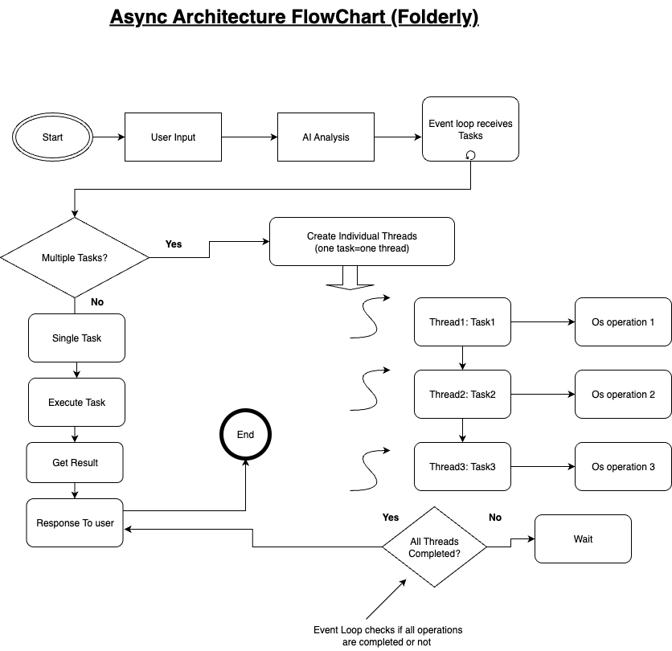

# Folderly - Smart Desktop File Management with AI Integration 🚀

Folderly is an intelligent desktop file management system that combines powerful file operations with AI-powered assistance. It helps you organize, declutter, and manage your files across Desktop, Documents, Downloads, and other folders with natural language commands and smart automation.

## 📦 **Current Version: v1.0.5**

**Latest Release:** Available on PyPI as `folderly` package  
**Status:** Production Ready - Stable Release

### **Quick Start (30 seconds)**
```bash
# Install from PyPI
pip install folderly

# Set API key
echo "OPENAI_API_KEY=your_key_here" > .env

# Start using!
folderly-ai
```

## ✨ **Key Features**

### **🤖 AI-Powered Interface**
- **Natural language commands** - "list my desktop", "create a folder called work", "move all txt files to documents"
- **Smart function selection** - AI automatically chooses the right operation for your request
- **Real-time streaming responses** - See AI responses build up word by word
- **Multi-task handling** - Execute multiple operations from a single command

### **📁 Core File Operations**
- **List and explore** files/folders with advanced filtering (extension, type, date, size)
- **Create directories** - Single or multiple nested folders
- **Move files/folders** - Bulk operations with smart execution
- **Copy items** - Safe copying with conflict handling
- **Rename items** - Batch renaming operations
- **Delete safely** - Files go to recycle bin, not permanently deleted

### **⚡ Performance & Smart Execution**
- **Async operations** - Non-blocking file operations for better performance
- **Smart execution modes** - Automatic parallel/sequential mode selection
- **Cross-platform** - Works on Windows, macOS, and Linux

## 🏗️ **System Architecture**

Folderly uses a sophisticated AI-powered architecture that processes user requests through multiple stages:

<figure>
  
  <figcaption>Complete system flow showing user input, AI processing, function execution, and result handling</figcaption>
</figure>

**Key Components:**
- **User Input Processing**: Captures and validates user commands
- **AI Processing Engine**: Analyzes requests using OpenAI GPT-4o
- **Function Schema Injection**: Provides AI with available operations
- **Sequential Function Execution**: Executes file operations one by one
- **Context Building**: Maintains conversation history for intelligent responses
- **Result Processing**: Stores and processes function outcomes

## 🚀 **Async Architecture**

Folderly's async architecture ensures non-blocking operations and optimal performance:

<figure>
  
  <figcaption>Async architecture showing event loop, individual threads, and parallel execution</figcaption>
</figure>

**Async Benefits:**
- **Non-blocking I/O** - File operations don't freeze the interface
- **Parallel processing** - Multiple independent operations run simultaneously
- **Sequential safety** - Dependent operations execute in order
- **Smart execution strategy** - Automatic parallel/sequential mode selection

📖 **[Detailed Async Architecture Documentation](docs/ASYNC_ARCHITECTURE.md)**

## 💬 **Usage Examples**

### **Basic Operations**
```
💭 You: list my desktop
🤖 I'll help you scan your Desktop. Let me discover all available Desktop locations first...
🔧 Function call detected, executing...
🔍 Discovering user paths... ✅

I found 2 Desktop locations:
1. 📂 C:\Users\username\Desktop - 15 files 💾 Local
2. 📂 C:\Users\username\OneDrive\Desktop - 8 files ☁️ OneDrive
```

### **Multi-Step Operations**
```
💭 You: create a folder called "work" and move all txt files there
🤖 🎯 Operation Results:
    ✅ Created: 'work' folder
       📍 Location: Desktop
       🗂️ Full Path: C:/Users/username/Desktop/work

    ✅ Moved: 'notes.txt', 'todo.txt', 'ideas.txt'
       📍 Destination: work folder
```

## 🚀 **Installation**

### **Option 1: PyPI (Recommended)**
```bash
pip install folderly
echo "OPENAI_API_KEY=your_api_key_here" > .env
folderly-ai
```

### **Option 2: Poetry (Developers)**
```bash
git clone <repository-url>
cd Folderly-ProtoType
poetry install
poetry run folderly-ai
```

### **Option 3: Docker**
```bash
git clone <repository-url>
cd Folderly-ProtoType
docker-compose up --build
```

## 🏗️ **Project Structure**

```
Folderly-ProtoType/
├── src/
│   ├── core/           # Core file operations
│   ├── ai/             # AI integration
│   ├── cli/            # Command line interface
│   └── utils/          # Utility functions
├── tests/              # Test files
├── docs/               # Documentation
│   ├── ASYNC_ARCHITECTURE.md  # Async architecture details
│   ├── DOCKER_USAGE.md        # Docker usage guide
│   └── SECURITY_SETUP.md      # Security configuration
└── pyproject.toml      # Poetry configuration
```

## 🔧 **Technical Features**

- **OpenAI GPT-4o** - Latest AI model for natural language understanding
- **Function calling** - Precise operation execution with structured schemas
- **Context awareness** - AI remembers conversation history
- **Safe operations** - Files go to recycle bin, not permanently deleted
- **Error handling** - Graceful failure with helpful error messages

## 📦 **Dependencies**

- **openai** - AI integration and function calling
- **python-dotenv** - Environment variable management
- **send2trash** - Safe file deletion (recycle bin)

## 🧪 **Testing**

```bash
poetry run pytest
poetry run pytest --cov=src
```

## 🤝 **Contributing**

1. **Fork the repository**
2. **Create a feature branch**: `git checkout -b feature/amazing-feature`
3. **Make your changes** and add tests
4. **Submit a pull request**

## 📝 **License**

This project is open source and available under the MIT License.

---

**Folderly: Your files, intelligently organized.** 🚀✨

*Ready to transform your file management experience? Start with `folderly-ai` and let AI handle the rest!*