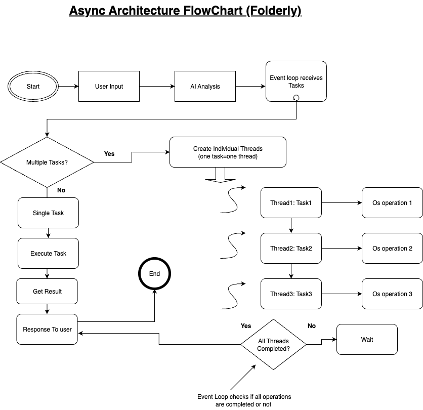

# Folderly Async Architecture

## Overview

Folderly uses a sophisticated **async + threading architecture** to handle multiple file operations efficiently without blocking the user interface.

## 🏗️ Architecture Components

<figure>
  
  <figcaption>Async architecture showing event loop, individual threads, and parallel execution</figcaption>
</figure>

### Event Loop (Main Controller)
- **Receives** all tasks from AI
- **Creates** individual threads for each task
- **Manages** thread execution and coordination
- **Collects** results from all threads
- **Responds** to user with complete status

### Threading Layer
- **Individual threads** for each file operation
- **Parallel execution** of same-type operations
- **Non-blocking** file system operations
- **Independent** OS operation handling

### OS Operations Layer
- **File system operations** (create, move, copy, delete)
- **I/O bound operations** that would block the event loop
- **Threaded execution** for responsiveness

## 🔄 How It Works

### 1. Task Reception
```
User Request → AI Analysis → Event Loop Receives Multiple Tasks
```

### 2. Thread Creation
```
Event Loop → Creates Individual Thread for Each Task
```

### 3. Parallel Execution
```
Thread 1: Create folder "work"     → OS Operation 1
Thread 2: Create folder "backup"   → OS Operation 2
Thread 3: Create folder "temp"     → OS Operation 3
Thread 4: Move files to "work"     → OS Operation 4
```

### 4. Synchronization
```
Event Loop Waits → All Threads Complete → Collect Results → Respond to User
```

## ⚡ Why Async + Threading?

### The Problem
- **File operations are I/O bound** (waiting for disk/OS)
- **They block the event loop** (nothing else can run)
- **User interface freezes** during file operations

### The Solution
- **Event Loop stays responsive** (handles other requests)
- **File operations run in threads** (non-blocking)
- **Parallel execution** of multiple operations
- **Efficient resource utilization**

## 🎯 Key Benefits

1. **Non-blocking**: User interface remains responsive
2. **Parallel execution**: Multiple operations run simultaneously
3. **Efficient**: Better resource utilization
4. **Scalable**: Handles multiple operations efficiently
5. **Safe**: Dependent operations wait for each other

## 📊 Performance Example

### Without Async (Sequential)
```
Create 3 folders: 3 seconds
Move 10 files: 10 seconds
Total: 13 seconds
```

### With Async + Threading (Parallel)
```
Create 3 folders: 1 second (parallel)
Move 10 files: 1 second (parallel)
Total: 2 seconds
```

## 🔧 Technical Implementation

### Thread Creation
```python
# Each task gets its own thread
for func, args, kwargs in operations:
    if asyncio.iscoroutinefunction(func):
        tasks.append(func(*args, kwargs))
    else:
        tasks.append(asyncio.to_thread(func, *args, kwargs))
```

### Parallel Execution
```python
# All threads run simultaneously
return await asyncio.gather(*tasks)
```

### Synchronization
```python
# Wait for all operations to complete
results = await execute_operations(operations, "parallel")
```

## 🚀 Use Cases

### Perfect For
- **Multiple folder creation**
- **Bulk file operations**
- **File organization tasks**
- **Batch operations**

### Sequential Operations
- **Dependent operations** (move files after creating folders)
- **Single operations** (simple file operations)
- **Error-sensitive operations** (need to wait for completion)
